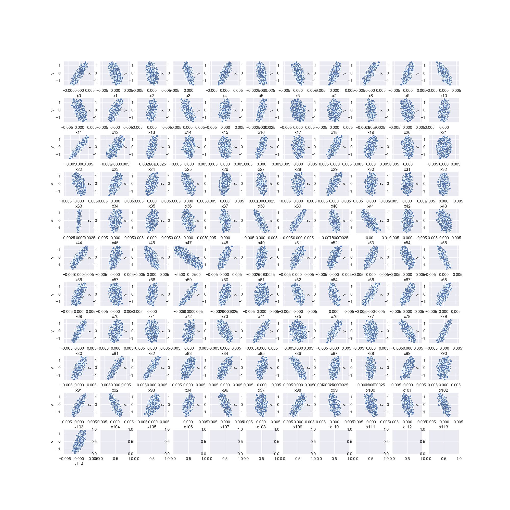

# Statistical-Machine-Learning-Project

## Description:
This repository can be used as a template for all basic statistical machine learning projects and challenges on Kaggle for example. 
The process includes feature engineering, machine learning model selection, parameter tuning and final test prediction. All of the 
machine learning models are from packages like scikit-learn, xgboost, etc. For the dataset provided, it asks for a regression model 
to fit the dataset.

## Package Requirements:
`numpy >= 1.15`

`matplotlib >= 2.2.2`

`pandas >= 0.20`

`seaborn >= 0.8`

`sklearn >= 0.20`

`xgboost >= 0.80`

## Dataset:
The dataset consists of training dataset and test dataset. Both datasets can be downloaded from [here](https://www.dropbox.com/s/pt59ldoyhci8lvh/data.zip?dl=0).
It includes 115 featrues and a label and asks for a regression model for the dataset.

## Statistical Machine Learning Procedure:

### Feature Engineering:
`preprocess.py` basically conducts feature engineering, which is the most important step for statistical modeling. 

1. After reading the dataset, it can be obseved that the training set has dimension (40000, 116) while the test set has (10000, 115). 
The difference in the second dimension is due to the unknown of labels in the test set. `read_data()`

2. Then by looking deeper into the features, there are 6 features that are not pure numerical values, which are "*x44*": '0.0%' as percentages, 
"*x50*": 'tuesday' as week days, "*x59*": '$-1832.38' as money, "*x63*": 'Orang' as colors, "*x65*": 'D' as letters and "*x95*": 'Aug' as months. `check_data()`

3. There are nan values throughout the dataset and need to be imputed for further modeling. The nan rate of all feature are very low, each of which are within 0.05%. `check_data()`

4. Conduct fillings of nan values. Fill the numerival values with their mean, and fill the categorical values with one of their modes. `fill_data()`

5. Conduct nemerical value transformation. Transform the string values of "*x44*" and "*x59*" to numerical values by eliminating "%" and "$".
Apply (cyclical feature sine transform)[http://blog.davidkaleko.com/feature-engineering-cyclical-features.html] on "*x50*" and "*x95*" 
to become cyclical categorical values which can preserve the temporal relationship between catehories. For example, 
Janurary would have the same distances from Feburary and December at the same time. Finally use one-hot encoding (pandas dummy method) on
"*x63*" and "*x65*". `process_data()`

6. Eliminate the original categorical data and finish the numerical data transformation.

7. For each numerical feature and the target, a scatter plot can be plotted using `seaborn` scatter plots as shown below.
From the scatter plots, there is no obvious non-linear relationship for any of the features and the target pair. 
This indicates linear models would be enough to model the data. But in the modeling section, various models are tested not only linear models.

### Model training:
`train.py` trains various models on the preprocessed dataset using 10-fold cross-validation. The tested models includes:

1. Linear Models(linear regressor, ridge regressor, LASSO and elastic net), 

2. Decision Tree Regression Models(tree regressor), 

3. SVM Model(Support Vector Regressor),

4. Ensemble Methods(gradient boosting regressor and random forest regressor), 

5. XGBoost Regressor.

The initial test uses mostly default parameters for rough comparison of the performances. The comparison results are shown in the following table:

| Machine Learning Model | Train RMSE Mean | Test RMSE Mean| Training Time |
| ------------- | ------------- | ------------- | ------------- |
| Linear Regressor | 0.04997031282085098 | 0.05006506273219417 | 0.1864017009735108 |
| Gradient Boosting Regressor | 0.06064396643628590 | 0.06368496920170959 | 25.576394796371460 |
| XGBoost Regressor | 0.06068052926407765 | 0.06378705903525582 | 34.056245589256285 |
| Random Forest Regressor | 0.03104223870507892 | 0.07180641652308876 | 28.301605033874512 |
| Ridge Regressor | 0.09577123845784331 | 0.09602409718570458 | 0.1241678714752197 |
| Decision Tree Regressor | 5.154926766741686e-05 | 0.10409560367939409 | 4.3303292751312250 |
| LASSO | 0.20097340732199193 | 0.20154210018831317 | 0.1408262252807617 |
| Elastic Net | 0.20097338877815502 | 0.20154222277730208 | 0.1316480875015259 |
| SVR | 0.61662531900404330 | 0.61265124522170810 | 15.022928524017335 |

The top two models with the lowest test RMSE are Linear Regressor and Gradient Boosting Regressor. 
Further parameter tuning will be focused on these two methods.

### Parameter Tuning:
`model_selection.py` uses grid search to conduct parameter tuning on Linear Regressor and Gradient Boosting Regressor. 
Since there is no parameter to be tuned for Linear Regressor, only parameters of Gradient Boosting Regressor are tuned for better performance.

The final parameters choices are:

1. Linear Regressor: None.

2. Gradient Boosting Regressor: {'learning_rate': 0.1, 'max_depth': 5, 'min_samples_leaf': 5, 'n_estimators': 200}.

The final performance for the selected models are:

| Machine Learning Model | Train RMSE Mean | Test RMSE Mean| Training Time |
| ------------- | ------------- | ------------- | ------------- |
| Linear Regressor | 0.050052542399522004 | 0.050139724161193396 | 0.463810467720032 |
| Gradient Boosting Regressor | 0.044950090094648509 | 0.057370840962319106 | 164.3019992828369 |

Overall, Linear Regressor still has a better performance while Gradient Boosting Regressor is slightly overfitted.

### Test Set Prediction:
`prediction.py` preprocesses the test set as in `preprocess.py` and predict using the trained models.

## Code Usage:
1. Download data into a folder called data.
2. Run `preprocess.py` and ply with it to preprocess the dataset.
3. (Optional) Modify `train.py` to add or change models for further learning.
4. Run `model_selection.py` to save the trained models.
5. Run `predict.py` to preprocess the test data and predict the targets.
